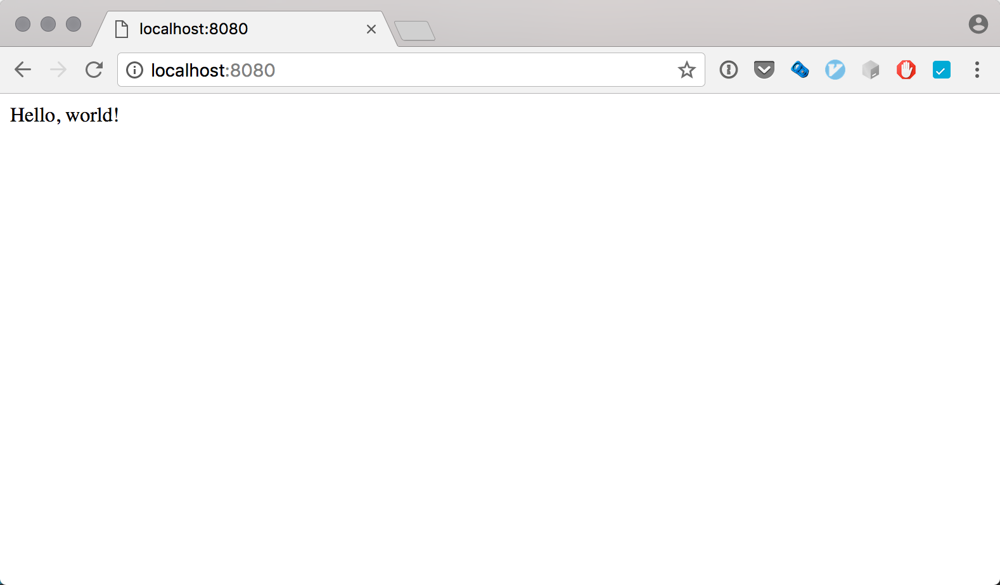

## Creating a Ktor Application

This tutorial will guide you through the steps on how to create a simple self-hosted Ktor Application that responds to HTTP requests with `Hello, World!`. 
 Ktor applications can be built using common build systems such [as Maven](https://kotlinlang.org/docs/reference/using-maven.html) or [Gradle](https://kotlinlang.org/docs/reference/using-gradle.html).

### Including the right dependencies

Ktor is split up into several groups of modules, allowing us to include only the functionality that we need. For a list of these modules please see [Artifacts](Artifacts). In our case we
only need to include `ktor-netty` (`ktor-core` which is required for any Ktor application is included transitively on including the former).  

These dependencies are hosted on [Bintray](https://bintray.com/kotlin/ktor) and as such the right 
repositories need to be added to our build script. 

Maven:
```maven
<repository>
    <id>bintray-kotlin-ktor</id>
    <name>bintray</name>
    <url>http://dl.bintray.com/kotlin/ktor</url>
</repository>
```

Gradle:
```gradle
    maven { url  "http://dl.bintray.com/kotlin/ktor" }
```

### Creating a self-hosted Application 

Ktor allows applications to be hosted under Application Server such as Tomcat, or self-host, using Jetty or Netty. In this tutorial we're going to see how to self-host using Netty. 

We begin by creating an `embeddedNettyServer`, passing in the port as the first argument and the actual application code as the third argument (second argument is the host which by default is 0.0.0.0). The code below defines
a single route that responds to the `GET` verb on the url `/` with the text `Hello, world!`

Once we've defined the routes, we start the server by calling `server.start`, passing as argument a boolean to indicate whether we want the main thread
of the application to block.  

```kotlin
fun main(args: Array<String>) {
    val server = embeddedServer(Netty, 8080) {
        routing {
            get("/") {
                call.respondText("Hello, world!", ContentType.Text.Html)
            }
        }
    }
    server.start(wait = true)
}
```
 
### Running the Application

Given that the entry point to our application is a the standard Kotlin `main` function, we can simply run it and have our server start, listening on the designated port. 




### Next Steps

This was the simplest example of getting a self-hosted Ktor application up and running. Next steps will be to understand the [Application](Application) object as well as [Features](Features).

For a more detailed Getting Started example see [Getting Started with IDEA and Gradle](Getting-Started-IDEA-Gradle.md)
